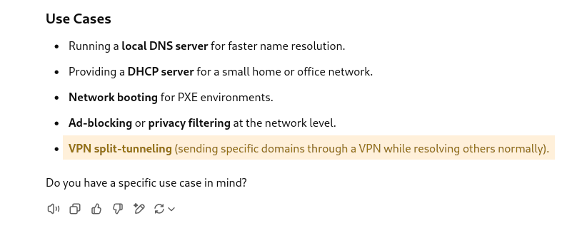

理由は不明ですが、openconnectで学校のVPN(GlobalProtect)に接続するとネットが使えなくなります。それを解決したいと思います。

# なぜVPNに繋ぎたいのか

学校のmoodleや一部のサービスがVPN下にあるからです。

全部特定のドメインのサブドメインでアクセスできるので、dnsmasqでそれらを全部VPNのTUNに繋いで、それ以外を普通に通せば良いのでは、ということです。

dnsmasqの使い方勉強してきます。

...

これだ!!!!

