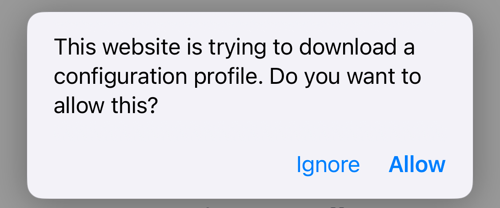
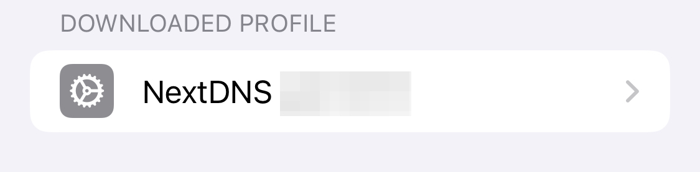
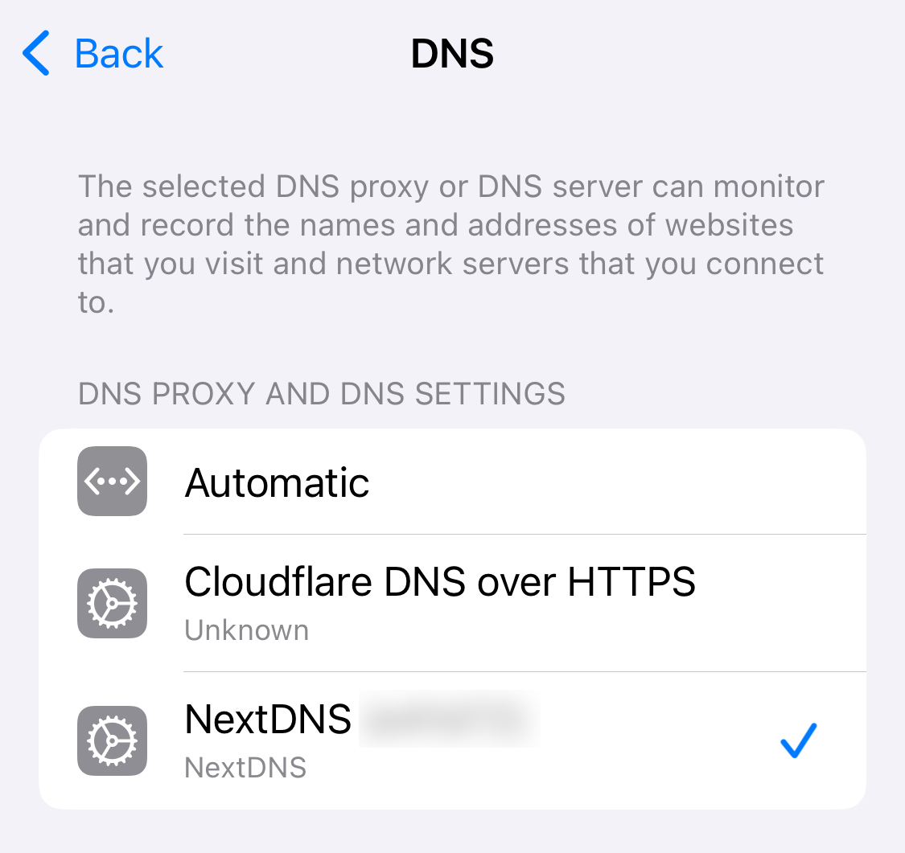
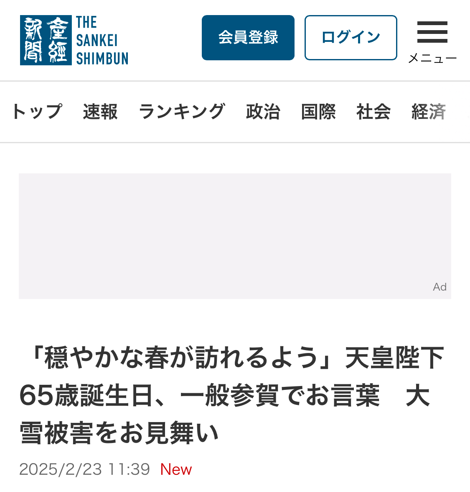

#technology #network 

極力手順を省きます

## 必要なもの
* iOS端末

# 1. NextDNSへのアカウント登録

https://my.nextdns.io/signup

# 2. Profileのインストール

1. https://apple.nextdns.io/ にアクセス
2. My First Profileを選択。Device Nameには`スマホ`など分りやすい名前を入れる。
3. Downloadを押す
4. Allowを選択 
5. General -> VPN & Device Management -> DOWNLOADED PROFILE から NextDNSを選択、インストール 

# 3. DNSを選択

# 4. ネットサーフィンする
広告が表示されそうなサイトを見てみる。すでに結構広告が消えていると思われる。
以下は、~~普段めったに使わない~~産経新聞の例である。

# 5. Dashboardにアクセス

1. https://my.nextdns.io
2. Logsを開く
3. なんかいっぱいでてくる。これが、スマホがクエリしたドメインの一覧である。

> [!note]
大体はNextDNSのデフォルトの設定でブロックしてくれるが、日本のサイトはカバーされていないことも多い。そのような場合は、ドメインDenylistに入れて個別にブロックすれば良い。

